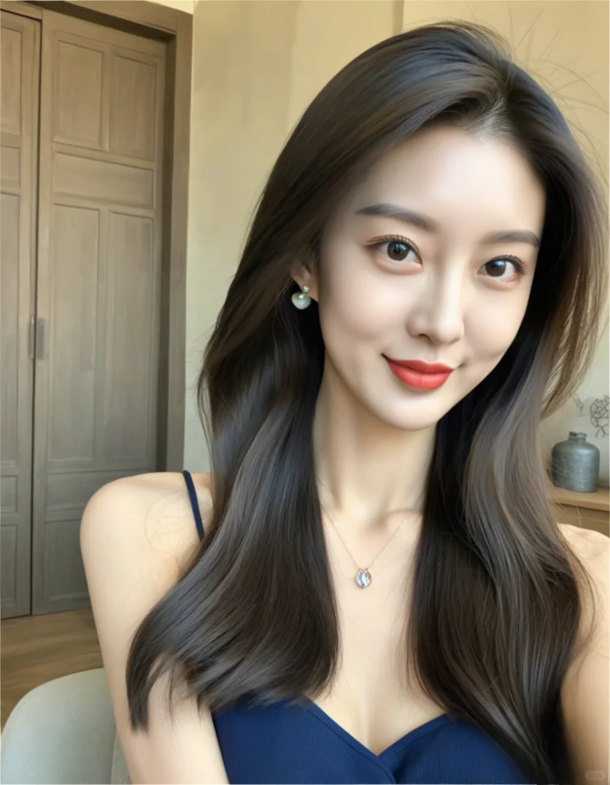
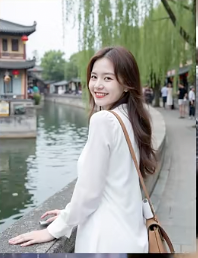

定位：35岁人妻
变现： 

中文描述：

这幅图呈现了一位韩国女性，她拥有精致的五官和白皙的肌肤。她的深棕色波浪长发随意地散落着，穿着一件灰色的一字领上衣，展现出优美的锁骨线条。背景中的咖啡店以蓝色调为主，可以看见咖啡机和其他装饰物。自然光线从侧面打来，使她的脸部轮廓更显立体。自拍视角巧妙地捕捉到了她的侧脸，增加了真实感。

英文描述：

The image captures a Korean woman with delicate facial features and fair skin. Her long, wavy dark brown hair cascades down her shoulders, complementing her gray off-shoulder top that reveals her collarbone. The backdrop features a coffee shop with blue accents and coffee-making equipment. Soft natural light illuminates her from the side, accentuating her profile. The selfie angle skillfully showcases her side profile, adding authenticity to the shot.

中文描述：

这幅图呈现了一位韩国女人，她拥有精致的五官和白皙的肌肤。她的深棕色波浪长发随意地散落着，穿着一件灰色的一字领上衣，展现出优美的锁骨线条。背景中的咖啡店以蓝色调为主，可以看见咖啡机和其他装饰物。自然光线从侧面打来，使她的脸部轮廓更显立体。自拍视角巧妙地捕捉到了她的侧脸，增加了真实感。

英文描述：

The image captures a Korean woman with delicate facial features and fair skin. Her long, wavy dark brown hair cascades down her shoulders, complementing her gray off-shoulder top that reveals her collarbone. The backdrop features a coffee shop with blue accents and coffee-making equipment. Soft natural light illuminates her from the side, accentuating her profile. The selfie angle skillfully showcases her side profile, adding authenticity to the shot.

中文描述：

这幅图呈现了一位韩国女人，她拥有精致的五官和白皙的肌肤。她的深棕色直长发柔顺地滑过肩膀，穿着一件深色的吊带裙，展现出优美的锁骨线条。背景中的木质门和一旁的花瓶暗示了这是一个温馨的室内环境。自然光线从侧面打来，使她的脸部轮廓更显立体，嘴角微微上扬，增添了几分亲和力。

英文描述：

The image captures a Korean woman with delicate facial features and fair skin. Her long, straight dark brown hair flows down her shoulders, complemented by a deep V-neck dress that reveals her collarbone. The backdrop suggests an indoor setting, possibly a bedroom or living room with wooden doors and a vase. Soft natural light illuminates her from the side, accentuating her profile and the subtle smile on her face. The selfie angle skillfully showcases her

中文描述：

这幅图呈现了一位韩国女人，她拥有精致的五官和白皙的肌肤。她的深棕色直长发柔顺地滑过肩膀，穿着一件黑色的挂脖连衣裙，展现出优美的锁骨线条。背景中的家具和透进来的阳光表明这是一个舒适的室内环境。自然光线从侧面打来，使她的脸部轮廓更显立体，嘴角微微上扬，增添了几分亲和力。

英文描述：

The image captures a Korean woman with delicate facial features and fair skin. Her long, straight dark brown hair flows down her shoulders, complemented by a black halter dress that reveals her collarbone. The backdrop suggests an indoor setting, possibly a bedroom or living room with furniture and windows allowing in natural light. Soft sunlight illuminates her from the side, accentuating her profile and the subtle smile on her face. The selfie angle skillfully showcases her side profile and adds warmth to the overall composition.

中文描述：

这幅图呈现了一位韩国女人，她拥有精致的五官和白皙的肌肤。她的深棕色大卷发柔顺地滑过肩膀，穿着一件浅色的背心，展现出优美的锁骨线条。背景中的白色墙面和柜子表明这是一个简洁的室内环境。自然光线从侧面打来，使她的脸部轮廓更显立体，嘴角微微上扬，增添了几分亲和力。

英文描述：

The image captures a Korean woman with delicate facial features and fair skin. Her long, curly dark brown hair flows down her shoulders, complemented by a light-colored tank top that reveals her collarbone. The backdrop suggests an indoor setting, possibly a beauty salon with white walls and cabinets. Soft sunlight illuminates her from the side, accentuating her profile and the subtle smile on her face. The selfie angle skillfully showcases her side profile and adds warmth to the overall composition.

中文描述：

这幅图呈现了一位韩国女人，她拥有精致的五官和白皙的肌肤。她的深棕色长发柔顺地滑过肩膀，穿着一件白色的衬衫，站在一座小桥上欣赏风景。背景中的中国传统建筑和河流营造出一种宁静的氛围。自然光线从侧面打来，使她的脸部轮廓更显立体，嘴角微微上扬，增添了几分亲和力。

英文描述：

The image captures a Korean woman with delicate facial features and fair skin. Her long, dark brown hair flows down her shoulders as she stands on a bridge by a river, wearing a white shirt. Behind her, traditional Chinese architecture and a river create a serene backdrop. Soft sunlight illuminates her from the side, accentuating her profile and the subtle smile on her face. The selfie angle skillfully showcases her side profile and adds warmth to the overall composition.

